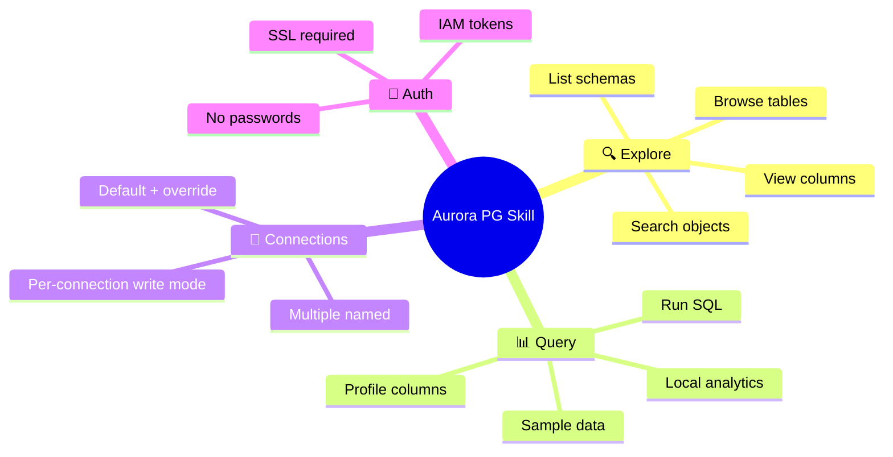
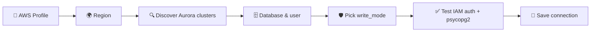
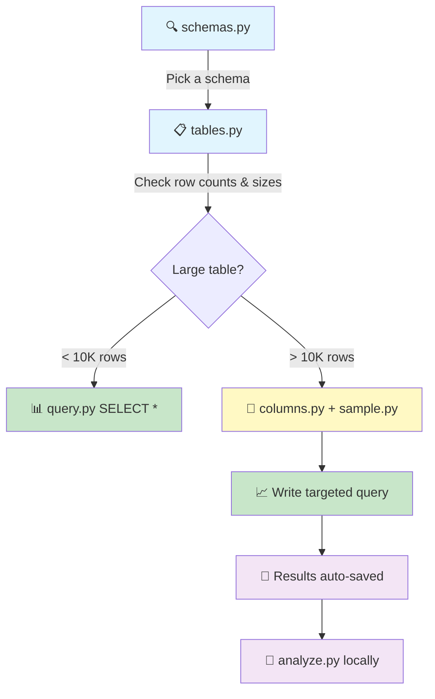
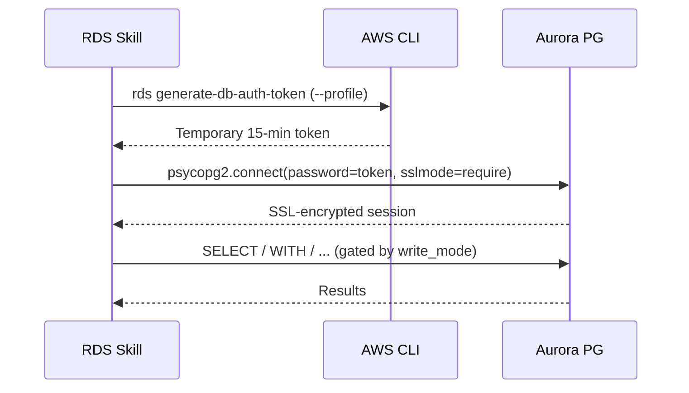

# 🐘 Aurora PostgreSQL Skill

> **Your AI-powered data analyst for AWS Aurora PostgreSQL.** Explore schemas, run queries, profile data — IAM-authenticated, multi-connection, with a per-connection write-mode toggle so you can keep prod read-only while letting dev/local accept writes.

Works with **any AI coding agent** — Claude Code, Cursor, Codex, and more.

```
🛡️ IAM auth (no passwords)     🔌 Multi-connection     🧯 Per-connection write-mode     🖥️ Mac + Windows
```

## 📑 Table of Contents

- [✨ What can it do?](#-what-can-it-do)
- [🚀 Quick Start](#-quick-start)
- [📖 Scripts](#-scripts)
  - [🔍 Exploration](#-exploration)
  - [📊 Querying & Analysis](#-querying--analysis)
- [🔌 Connections](#-connections)
- [🔄 Recommended Workflow](#-recommended-workflow)
- [📈 Business Analysis Patterns](#-business-analysis-patterns)
- [🛡️ Safety](#️-safety)
  - [Write modes](#write-modes)
  - [Defensive query rules](#defensive-query-rules)
- [📂 Output & File Saving](#-output--file-saving)
- [⚙️ Configuration](#️-configuration)
- [🧰 Prerequisites](#-prerequisites)
- [🔐 Security & Connection](#-security--connection)
- [📜 License](#-license)

## ✨ What can it do?



## 🚀 Quick Start

### 1. Install

```bash
npx skills add onsen-ai/rds-skill
```

Or install globally:

```bash
npx skills add onsen-ai/rds-skill -g
```

> See [vercel-labs/skills](https://github.com/vercel-labs/skills) for more install options.

### 2. Setup

Run the interactive wizard in your terminal:

```bash
python3 scripts/setup.py    # macOS / Linux
python scripts/setup.py     # Windows
```

The wizard walks you through:



Config is saved to `~/.rds-skill/config.json` — re-run anytime to add another connection or edit an existing one.

### 3. Go!

```bash
python3 scripts/query.py "SELECT count(*) FROM sales.orders"
```

That's it. All scripts auto-detect your default connection. 🎉

## 📖 Scripts

### 🔍 Exploration

| Script | What it does | Example |
| ------ | ------------ | ------- |
| `schemas.py` | List all schemas, owners, and table counts | `schemas.py` |
| `tables.py` | Browse tables with row counts, sizes, last vacuum/analyze | `tables.py --schema=sales` |
| `columns.py` | Column types, nullability, defaults, indexes | `columns.py --schema=sales --table=orders` |
| `search.py` | Find tables/columns by name pattern | `search.py --pattern=revenue` |
| `sample.py` | Peek at actual data values | `sample.py --schema=sales --table=customers --limit=5` |

### 📊 Querying & Analysis

| Script | What it does | Example |
| ------ | ------------ | ------- |
| `query.py` | Run SQL (read-only by default; writes gated by `write_mode`) | `query.py "SELECT ..."` or `query.py --sql-file=my.sql` |
| `profile.py` | Per-column stats (nulls, cardinality, min/max/avg) | `profile.py --schema=sales --table=customers` |
| `analyze.py` | Local analytics on saved files — **no Aurora needed** | `analyze.py data.csv --describe` |

#### 🧮 analyze.py operations

```bash
analyze.py data.csv --describe                        # Per-column statistics
analyze.py data.csv --sum=revenue                     # Sum a column
analyze.py data.csv --group-by=region --avg=sales     # Group by + aggregate
analyze.py data.csv --filter='year=2024' --top=10     # Filter + top N
analyze.py data.csv --hist=price                      # Text histogram
```

## 🔌 Connections

The skill supports **multiple named connections**. Useful when you have separate clusters per env (prod / staging / dev / local).

| Command | What it does |
| ------- | ------------ |
| `setup.py` | Interactive: add a new connection or edit an existing one |
| `setup.py --list` | Show all connections, mark the default with `*` |
| `setup.py --set-default NAME` | Switch which connection is used by default |
| `setup.py --remove NAME` | Delete a connection |

Pick a specific connection on any script invocation:

```bash
python3 scripts/query.py --connection staging "SELECT count(*) FROM sales.orders"
```

Without `--connection`, scripts use whichever connection is marked `default`. Old single-connection configs are auto-migrated on first read — no action needed.

You can still pass `--host` / `--database` / `--db-user` / `--profile` directly without a saved config, for one-off ad-hoc connections.

## 🔄 Recommended Workflow



> 💡 **Don't follow this rigidly.** If the user knows exactly what they want, skip straight to the query. This is a guide for unfamiliar schemas, not a checklist.

## 📈 Business Analysis Patterns

Built for real-world analyst work — product analysts, commercial analysts, BI developers.

| Pattern | Approach |
| ------- | -------- |
| 📊 **Trend analysis** | `GROUP BY DATE_TRUNC('month', col)` + `SUM`/`COUNT`, compare YoY/MoM |
| 👥 **Cohort analysis** | Group by first purchase date, track retention |
| 📉 **Root cause** | Decompose metric → slice by dimensions → drill into outliers |
| 🏆 **Top/Bottom N** | `ORDER BY metric DESC LIMIT N` |
| 📅 **YoY comparison** | `LAG()` window or self-join shifted by 1 year |
| 🔢 **Distribution** | `NTILE(100)`, percentiles, or `analyze.py --hist` locally |
| 🎯 **Pareto (80/20)** | Cumulative `SUM() OVER (ORDER BY ...)` |
| 🧩 **Segmentation** | `CASE WHEN` or `NTILE` to bucket, then profile each segment |

## 🛡️ Safety

### Write modes

Every connection has a `write_mode` — set it during `setup.py`. The mode determines what the skill is allowed to do on that connection:

| `write_mode` | Reads | Low-risk writes (INSERT, UPDATE/DELETE-with-WHERE, CREATE) | High-risk writes (DROP, TRUNCATE, UPDATE/DELETE without WHERE, ALTER DROP, GRANT, REVOKE) |
|---|---|---|---|
| `reject` *(default)* | run | **script blocks** | **script blocks** |
| `auto` | run | run | **agent stops, asks user, then runs** |
| `ask` | run | **agent stops, asks user, then runs** | **agent stops, asks user, then runs** |
| `accept` | run | run | run (no prompt) |

The script enforces only the `reject` floor — for `ask` / `auto`, the gating happens at the **agent level**: the AI agent (Claude / Codex / Cursor) is told via [SKILL.md](SKILL.md) to use its structured-question tool (e.g. Claude Code's `AskUserQuestion`) to confirm before submitting the query. This gives you a clean confirm/deny prompt instead of a chat exchange.

> 💡 **Pick `reject` for prod, `auto` for staging, `accept` for local dev.** Multi-statement queries are blocked in **all** modes as an injection defence.

### Defensive query rules

| Table size | Approach |
| ---------- | -------- |
| < 10K rows | Explore freely, `SELECT *` is fine |
| 10K – 1M rows | Add `WHERE` or `LIMIT`, prefer aggregations for full-table queries |
| > 1M rows | Always aggregate or filter, never `SELECT *`, use indexed-column filters |

## 📂 Output & File Saving

All results are **automatically saved** to `~/rds-exports/`:

- 📄 First 200 rows shown inline (txt preview)
- 💾 Full results saved as CSV (or `--save-format=json`/`txt`) for follow-up with `analyze.py`
- 📍 File path printed so the agent can read it for deeper analysis

```bash
--format=txt|csv|json    # Terminal display format (default: txt)
--save-format=...        # File save format (default: csv)
--save=PATH              # Save to a specific path
--no-save                # Skip auto-save
--save-sql               # Also save the SQL as a matching .sql file
```

## ⚙️ Configuration

`~/.rds-skill/config.json`:

```json
{
  "default": "prod",
  "python": "/usr/bin/python3",
  "connections": {
    "prod": {
      "profile": "de_rds",
      "host": "prod-cluster.cluster-xyz.eu-west-1.rds.amazonaws.com",
      "port": 5432,
      "database": "main",
      "db_user": "rds_skill_user",
      "region": "eu-west-1",
      "write_mode": "reject"
    },
    "staging": {
      "profile": "de_rds_stg",
      "host": "stg-cluster.cluster-abc.eu-west-1.rds.amazonaws.com",
      "port": 5432,
      "database": "main",
      "db_user": "rds_skill_user",
      "region": "eu-west-1",
      "write_mode": "auto"
    }
  }
}
```

Edit directly or re-run `python3 scripts/setup.py`. Pre-multi-connection configs (top-level `host` / `database` / `db_user` and no `connections` key) are auto-migrated to this shape on first read.

## 🧰 Prerequisites

- **Python 3.8+**
- **AWS CLI v2** — with a profile that has `rds-db:connect` permission on the cluster
- **psycopg2-binary** — installed automatically by `setup.py`
- **Network reachability** — typically corporate VPN, since Aurora endpoints sit in private subnets

> 💡 On macOS use `python3`, on Windows use `python`. The setup wizard saves your Python path so the agent uses the right one automatically.

## 🔐 Security & Connection

### IAM database authentication

The skill connects entirely through **AWS IAM database authentication** — no passwords, access keys, or secrets are stored anywhere. The config file (`~/.rds-skill/config.json`) holds only connection metadata.



Tokens expire automatically — no rotation needed.

### Required IAM policy

The AWS profile used by the skill needs:

```json
{
  "Version": "2012-10-17",
  "Statement": [
    {
      "Effect": "Allow",
      "Action": "rds-db:connect",
      "Resource": "arn:aws:rds-db:<region>:<account>:dbuser:<cluster-resource-id>/<db-user>"
    },
    {
      "Effect": "Allow",
      "Action": "rds:DescribeDBClusters",
      "Resource": "*"
    },
    {
      "Effect": "Allow",
      "Action": "sts:GetCallerIdentity",
      "Resource": "*"
    }
  ]
}
```

### One-time infrastructure setup

These need to be in place once per cluster — typically owned by your infra team:

| Requirement | How |
|---|---|
| IAM auth enabled on cluster | `iam_database_authentication_enabled = true` (Terraform) or via AWS console |
| DB user with IAM role | `GRANT rds_iam TO rds_skill_user;` |
| IAM policy | `rds-db:connect` on the cluster + user ARN (above) |
| Network reachability | VPN or peering — Aurora typically lives in private subnets |

Step-by-step IAM-auth setup walkthrough: [iam-auth-setup.md](iam-auth-setup.md).

### Defence in depth

The skill's per-connection `write_mode` is the **first** layer of write protection. For real safety, combine it with:

1. **A read-only DB user** (`GRANT SELECT` only) — enforced at the database layer.
2. **A scoped IAM policy** — `rds-db:connect` only on the read-only user ARN, not the admin user.
3. **`write_mode: reject`** on prod connections — the script never even submits writes.

## Built by

Built by the team at [Onsen](https://www.onsenapp.com) — an AI-powered mental health companion for journaling, emotional wellbeing, and personal growth.

## 📜 License

MIT — see [LICENSE](LICENSE).
